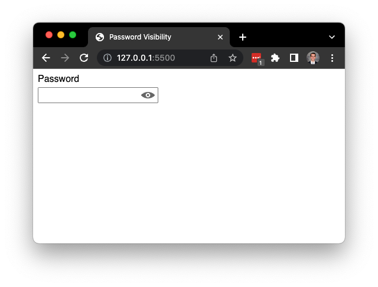
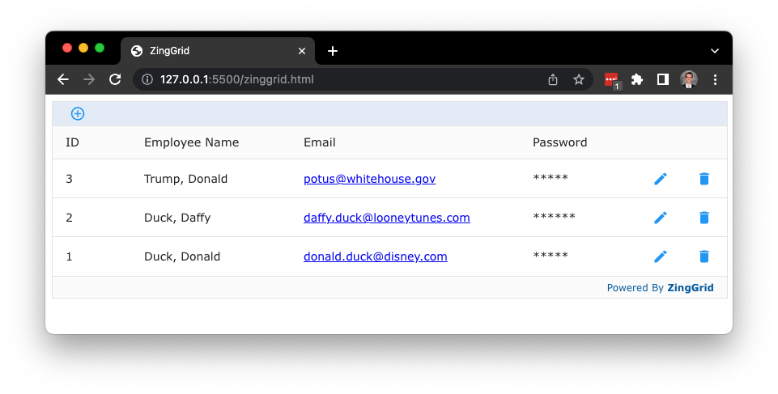
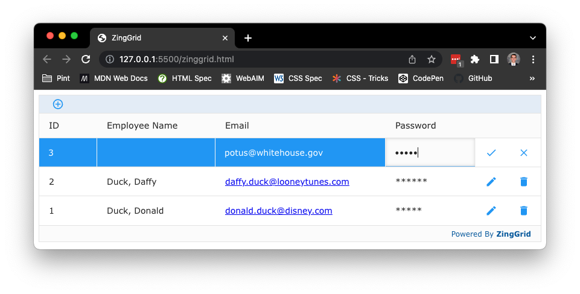
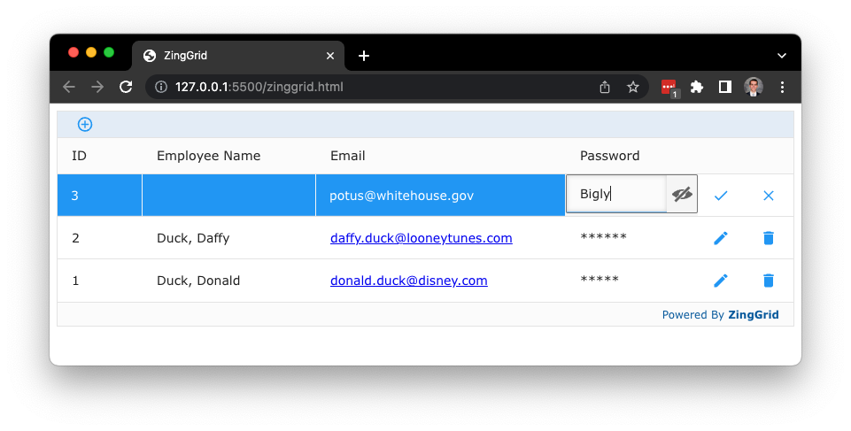

# Custom Password Fields & ZingGrid

**Author:** Camdyn Rasque<br>
**Date:** Sep 14, 2022

## The Problem

Many users may want to peak at their passwords to check that they've input
them correctly, so a common pattern is to include a button near the password input (often represented as an icon that looks like an eye) to show the password they've typed as plain text instead of the usual black circles.

Since English is written left to right, often the icon is included on the right
side *inside of the text input box*. Unfortunately this is also the same spot
that many password managers like to place their autofill button icons, which
leads to them overlapping.


Source: [@vponamariov on Twitter](https://twitter.com/vponamariov/status/1397891615306485760?s=20&t=o2G8yLZ0YRcuuzBTAhSSLw)

## Solving with Web Components

### The Initial Solution

This seems like a perfect use case for Web Components, so that is exactly what I made - the `<password-visibility>` component. On my first attempt I placed everything inside of the Shadow DOM so as to fully encapsulate the styles, where the final markup looked like the following:

```html
<!-- Using the component in your HTML -->
<password-visibility></password-visibility>

<!-- What the browser renders -->
<password-visibility>
	#shadowRoot
		<style>...</style>
		<label for="password">Password</label>
		<div>
			<input type="password" name="password" id="password">
			<button>
				<!-- Visible Icon -->
				<svg>...</svg>
				<!-- Invisible Icon -->
				<svg class="hidden">...</svg>
			</button>
		</div>
</password-visibility>
```

And this seems to be a popular solution too, as [other component libraries](https://shoelace.style/components/input?id=toggle-password) seem to use a similar approach.

Initially this does work well - it's self contained, requires no extra work when using it as it's a single tag, and is accessible in the sense that keyboard navigation still works well.

One major problem was found though: *Password manager extensions had a hard time finding password fields to populate if they were inside of a Shadow DOM*.



Which makes sense, a simple `document.querySelectorAll()` wouldn't return elements in the shadow, so (assuming the shadow was left open) they would have to find every element with a `shadowRoot` and query from inside each one individually (and that's not even mentioning nested Shadow Roots).

### Leaving Everything in the Light DOM

The first thought then to solve the issue is to remove the Shadow DOM all togther. Custom Elements don't require a shadow, and although it's not the best practice we can still append elements directly to the parent in the light DOM. Below is what we are left with:

```html
<!-- Using the component in your HTML -->
<password-visibility></password-visibility>

<!-- What the browser renders -->
<password-visibility>
	<style>...</style>
	<label for="password">Password</label>
	<div>
		<input type="password" name="password" id="password">
		<button>
			<!-- Visible Icon -->
			<svg>...</svg>
			<!-- Invisible Icon -->
			<svg class="hidden">...</svg>
		</button>
	</div>
</password-visibility>
```

Immediately we are hit with another issue: The `<style>` tag. Having a `<style>` tag floating in the light DOM in the `<body>` is not recommended on its own, but having multiple `<style>` tags all with *identical* styles inside of them that can now interact with each other is a recipe for disaster.

You could take the styles out and place them in the CSS file with the rest of the light DOM styles, but then you're starting to separate your component into multiple places and it loses its sense of self containment, so on to the next solution we go.

### Utilizing the `<slot>` element

Since we need some elements in the light DOM (`<label>` and `<input>`) and everything
else in the Shadow, this seems like a perfect use case for the `<slot>` element.

The `<slot>` element allows us to dynamically link light DOM elements in the Shadow so they can (to an extent) exist in both places.

Below is the resulting markup using this method (I've boxed in the shadowRoot so as to make clear what is in the shadow DOM and what is in the light DOM):

```html
<!-- Using the component in your HTML -->
<password-visibility>
	<label for="password" slot="label">Password</label>
	<input
		type="password"
		name="password"
		id="password"
		slot="password"
	>
</password-visibility>

<!-- What the browser renders -->
<password-visibility>
	#shadowRoot---------------------------------------------------|
	|	<style>...</style>                                        |
	|	<slot name="password">[[ link to label here ]]</slot>     |
	|	<div>                                                     |
	|		<slot name="password">[[ link to input here ]]</slot> |
	|		<button>                                              |
	|			<!-- Visible Icon -->                             |
	|			<svg>...</svg>                                    |
	|			<!-- Invisible Icon -->                           |
	|			<svg class="hidden">...</svg>                     |
	|		</button>                                             |
	|	</div>                                                    |
	|-------------------------------------------------------------|
	<label for="password" slot="label">Password</label>
	<input
		type="password"
		name="password"
		id="password"
		slot="password"
	>
</password-visibility>
```

Now that `<input>` is in the light DOM, password managers are able to find it just fine, the styles stay isolated in the shadow DOM, and the component maintains its self containment.


## Integrating with ZingGrid

Lets take a look at a simple ZingGrid that contains some user account data.

```html
<zing-grid editor-controls>
	<zg-colgroup>
		<zg-column index="employeeId" header="ID" type="number"></zg-column>
		<zg-column
			index="firstName,lastName"
			header="Employee Name"
			type="custom"
		>
			<template> [[index.lastName]], [[index.firstName]] </template>
		</zg-column>
		<zg-column index="email" header="Email" type="email"></zg-column>
		<zg-column
			index="password"
			header="Password"
			type="password-visibility"
		></zg-column>
	</zg-colgroup>
	<zg-data
		data='
			[{
				"firstName" : "Donald",
				"lastName" : "Trump",
				"email" : "potus@whitehouse.gov",
				"password" : "Bigly",
				"employeeId" : 3
			},
			{
				"firstName" : "Daffy",
				"lastName" : "Duck",
				"email" : "daffy.duck@looneytunes.com",
				"password" : "Daffy!",
				"employeeId" : 2
			},
			{
				"firstName" : "Donald",
				"lastName" : "Duck",
				"email" : "donald.duck@disney.com",
				"password" : "Bigly",
				"employeeId" : 1
			}
		]'
	></zg-data>
</zing-grid>
```

As you can see below, when the ZingGrid gets rendered to the screen all of the passwords are replaced with asterisks.



When editing one of the rows, we see that the cell in the Password column has become a plain input element of type password. Unfortunately, ZingGrid does not allow you to view the password in plain text.



Luckily replacing ZingGrid's default password cell editor with our own custom component is fairly simple since ZingGrid offers ways to create [Custom Editors](https://www.zinggrid.com/docs/features/editing#custom-editor) and [Custom Column Types](https://www.zinggrid.com/docs/features/custom-columns).

To create our new Custom Column type, we'll need two things:

- A renderer function
  - Runs after the cell has finished editing, but before any text is displayed on screen
  - Lets you modify the text that came from the editor. In our case, we'll be recreating the `password` column type censoring feature by replacing the password with asterisks.
- An editor object
  - Contains 3 editor lifecycle functions
  - Lets you insert custom markup to the editor cell in place of the default (You can also attach any other code needed for the editor here as well)
  - We'll be using this to create our custom component and append it to the cell

Let's start with the renderer function

```js
/**
 * Takes in a plain string password and outputs a censored string of
 * the same length
 * pw {string} - The password coming from either the initial data or editor
 * cellRef {element} - Direct reference to the DOM node for the cell
 * $cell {object} - An object containing various cell info
*/
function pvRenderer(pw, cellRef, $cell) {
	// Use RegEx to match every letter and replace with a * character
	return pw.replace(/./g, '*');
}
```

Now lets look at our editor object

```js
let editor = {
	/**
	 * The initializing function for the editor that runs once on page load
	 * $cell {object} - An object containing various cell info
	 * $editorField {element} - A reference to the element that holds the editor
	*/
	init($cell, editorField) {
		// Create our web component
		let passwordVisibility = document.createElement('password-visibility');
		// Create a new <input> to be slotted into it (label for a11y, hide it)
		passwordVisibility.innerHTML = `
			<label for="password" style="display:none">Password</label>
			<input
				type="password"
				name="password"
				id="password"
				slot="password"
			/>
		`;
		// Add web component to the editor field
		editorField.appendChild(passwordVisibility);
	},

	/**
	 * Runs right as the editor for the cell is opened
	 * $cell {object} - An object containing various cell info
	 * $editorField {element} - A reference to the element that holds the editor
	 * $mData {string || number} - The cell data to edit
	*/
	onOpen($cell, editorField, mData) {
		// Grab a reference to the <input> inside our web component
		let input = editorField.querySelector('input');
		// Check to make sure mData has a value
		if (!mData) mData = editorField.value || '';
		// Set the initial value of the <input> to mData
		input.value = String(mData);
	},

	/**
	 * Runs right as the editor closes when the user is done editing
	 * editorField {element} - A reference to the element that holds the editor
	*/
	onClose(editorField) {
		// Return the value of the <input> inside our web component
		return editorField.querySelector('input').value;
	},
};
```

And finally to put it all together, we need to register the functions to a
specific cell type

```js
// This is the type that we will set our <zg-column> to
ZingGrid.registerCellType('password-visibility', {
	editor: editor,
	renderer: pvRenderer,
});
```

And now when we edit our password we see our web component instead of the default password input field!




The only downside to note here is that since ZingGrid uses the shadow DOM, password managers wouldn't be able to access any of the password fields.